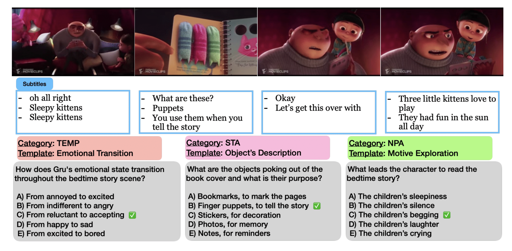
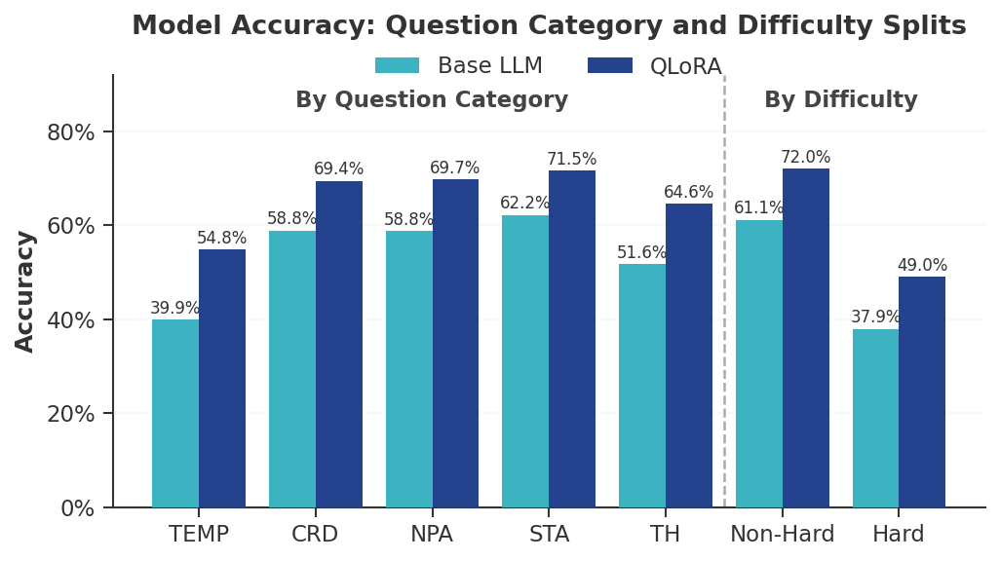
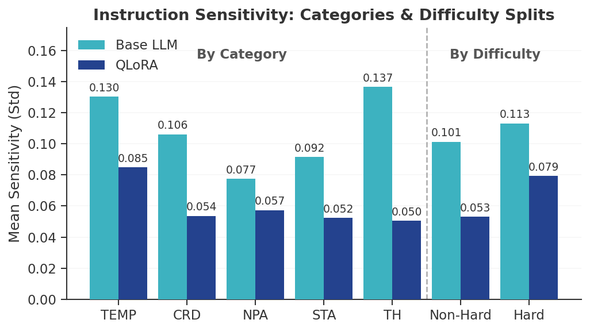
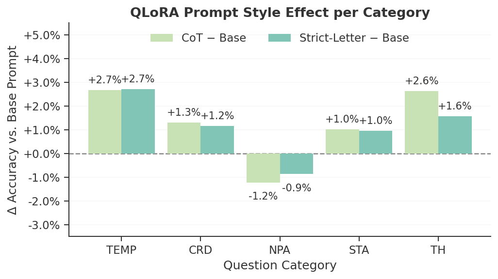

# movie-qa-peft-prompt-eng

<p align="center">
  
</p>

<p align="center">
  Check out our <a href="presentation.pdf">presentation</a> &nbsp; | &nbsp;
  Read our <a href="https:">Medium article</a> &nbsp; | &nbsp;
  Read our <a href="paper.pdf">paper</a>
</p>


# Abstract

Long-form movie question answering (Movie-QA) requires temporal, causal, and emotional reasoning over full-length narratives, making fine-tuning language models for this task both costly and difficult to deploy at scale. We explored Parametric-efficient fine-tuning (PEFT) methods such as QLoRA, Prefix-Tuning, and ReFT to update only a small fraction of parameters and examine whether different instruction prompt styles pose a significant impact on the accuracy considering model types and question categories. Our results demonstrate that the Llama 3 8B backbone consistently outperforms alternatives in this setting. Moreover, QLoRA fine-tuning not only improves accuracy (by 8.5%) across all reasoning categories but also acts as a strong stabilizer, reducing prompt sensitivity by up to an order of magnitude. Finally, we find that prompt engineering provides a consistent marginal gain on top of fine-tuning – CoT prompting further increases QLoRA accuracy by 1.22% and Strict-Letter prompting by 1.14% –  though these benefits are selective: temporal and thematic reasoning improve meaningfully while narrative retrieval categories show a slight degradation, highlighting the importance of aligning prompting strategies with task-specific reasoning requirements.

# Key Findings

### 1. QLoRA is a stronger fine-tuning method for deep-reasoning tasks than Prefix-Tuning and ReFT.

The underperformance of Prefix Tuning (61.8%) and ReFT (55.8%) can be attributed to their architectural constraints on a task requiring deep narrative synthesis. Prefix Tuning relies solely on prepended continuous prompt vectors. While effective for surface-level stylistic alignment, it lacks the parameter capacity to restructure the model's internal logic for multi-hop factual recall across thousands of tokens. 

ReFT struggled similarly. It improves isolated temporal tasks but degrades overall accuracy. Because ReFT edits representations at specific layers rather than updating attention weights, it is overly brittle for general MCQA.

In contrast, QLoRA adapts the base model's weights via low-rank matrices, modifying the model at a fundamental level. It outperformed both Prefix Tuning and ReFT across all cognitive categories, elevating the 60.0% baseline to 68.7%. Beyond raw accuracy gains, QLoRA also acts as a stabilizer across prompt styles, substantially reducing prompt sensitivity.

<p align="center">
  
  &nbsp;&nbsp;
  
</p>

### 2. Prompt engineering provides selective gains on top of fine-tuning, but the benefit depends on question type.

**Accuracy and Category-Level Gains.** QLoRA outperforms the Base LLM across all categories, with gains concentrated where the base model is weakest. TEMP sees the largest improvement (+14.9 pp), rising from near-chance (39.9%) to 54.8%, while other categories gain a more modest 6–9 pp. Applying CoT prompting further raises overall QLoRA accuracy from 68.7% to 69.92% (+1.22 pp), and Strict-Letter prompting achieves a comparable lift to 69.84% (+1.14 pp), confirming that structured prompt styles provide a consistent marginal gain on top of fine-tuning. On the Hard split, QLoRA improves by 11.1 pp (37.9% → 49.0%), disproportionately benefiting structurally complex questions. Despite this, a persistent 23 pp gap between Hard (49.0%) and Non-Hard (72.0%) accuracy remains, indicating that structurally difficult questions are not fully resolved by fine-tuning alone.

**Instruction Sensitivity.** The Base LLM exhibits the highest sensitivity on TH (0.137) and TEMP (0.130) — over 1.5× the sensitivity of NPA (0.077) — revealing that abstract and temporal reasoning are most vulnerable to prompt rephrasing. QLoRA dramatically suppresses this sensitivity across all categories (TH: −63%; TEMP: −35%), demonstrating that task-specific fine-tuning yields instruction robustness as an emergent side effect of alignment, without any explicit optimization for it.

**Selective Prompt Style Interactions.** Prompt style exerts selective rather than uniform effects. TEMP benefits most from both CoT and Strict-Letter (+2.7 pp each), and TH responds positively to CoT (+2.6 pp), confirming that structured prompting aids abstract and temporal reasoning. Conversely, NPA incurs a small CoT penalty (−1.2 pp), suggesting that over-instructing on factual plot retrieval introduces noise. These findings argue against applying a single static prompt template across all question types. For deployment, CoT or Strict-Letter is preferred for temporal and thematic questions, while a minimal Base-style prompt is safer for narrative retrieval.

<p align="center">
  
</p>

### 3. Directory Structure
```text
.
├── LICENSE
├── README.md
├── base_and_peft # Scripts to choose base models and experiment with three PEFT methods
├── data # experiment outputs
├── image
├── prompt_styles # Scripts to experiment with three instruction styles
├── pyproject.toml
├── result_analysis.ipynb # final analysis and visualization
├── strip_widget.py # clean colab artifacts for Github uploads
└── uv.lock
```